# infra-jira

JIRA 是一個缺陷跟蹤管理系統 ( Bug tracking system )，為針對缺陷管理、任務追蹤和專案管理的商業性應用軟體；其設計用來幫助品質保證和程式設計師在工作中維護軟體缺陷的跟蹤報告，也可以被認為是一種問題跟蹤管理系統 ( Issue tracking system )。

[Jira 軟體供應商宣布2024年停止支援伺服器版軟體](https://www.ithome.com.tw/news/140617)，目前官方文件推薦用戶申請可使用雲端的免費帳號進行適用。

## Atlassian

艾特萊森軟體 ( Atlassian Software ) 是一家澳大利亞軟體企業公司，主要為軟體開發者及項目經理設計軟體。這公司的主力產品為專門用作追蹤應用程式問題的 Jira，還有用作協作團隊的產品 Confluence，以及簡易項目管理的產品 Trello，版本管理儲存庫的產品 Bitbucket，版本管理工具 Sourcetree。

嚴格來說，多數的開發人員在其使用的專案管理工具不外乎都會與 Atlassian 有關聯；因此，若要使用相關服務，則需在 Atlassian 雲端註冊帳號，便可使用以下雲端服務，但需注意其收費機制是基於相關服務的總使用人數決定，超過定量人數會依居人數計算服務費用，若僅是個人使用多為免費機制，例如 Trello、Sourcetree。

+ 定價
    - [Jira](https://www.atlassian.com/zh/software/jira/pricing)
    - [Confluence](https://www.atlassian.com/zh/software/confluence/pricing)

若要使用相關服務，透過信箱自 [Atlassian 官方網站登入](https://id.atlassian.com/)，進入[用戶主頁](https://start.atlassian.com/)總覽所有服務的狀態，或進入[管理者介面](https://admin.atlassian.com/)檢視可用的產品與費用資訊。

##### 產品域名更換議題

在啟用 Jira 試用服務時，會需要設定一個產品名稱，其名稱也會構成域名網址，例如產品名稱為 ```product-name```，其域名為 ```product-name.atlassian.net```。

但若用戶僅是調查與試用後，確定正式與團隊合作使用，此時往往會需要替換為更符合團隊與公司需要的名稱，然而 Atlassian 並未提供更換域名的介面，若要更換域名則需發出支援單，請 Atlassian 官方協助更換。

+ [How do you change the name on an Atlas Workspace?](https://community.atlassian.com/t5/Atlas-questions/How-do-you-change-the-name-on-an-Atlas-Workspace/qaq-p/2252138)

另外，也有建議是申請一個新的帳號與空間並將資料與議題轉移至此空間，詳細操作參考 [Export data from Jira Cloud](https://support.atlassian.com/jira-cloud-administration/docs/export-issues/)。

## Jira Software

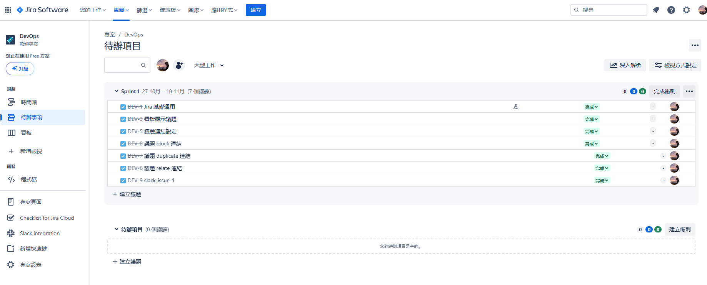

Jira 管理系統其資料結構如下：

+ [專案](#專案)
    - [議題](#議題)
        + [大型工作](#大型工作)
        + [子議題](#子議題)

### 專案

Jira 中可建立多個專案，以此區分對應不同軟體項目的設計議題管理。

在不同專案中，可調整如下項目：

+ ```專案 > 專案設定 > 存取```，以此調整可存取該專案的人員與角色，此項目需升級 Standard 才可使用。
+ ```專案 > 專案設定 > 議題類型```，以此調整此專案可用的議題類型與工作流。
+ ```專案 > 專案設定 > 看板```，以此調整看板呈現 Sprint 內容的欄位與方式。

其他項目可進入 ```專案 > 專案設定``` 觀察。

### 議題

Jira 對專案管理是根據敏捷開發 [Scrum](https://glints.com/tw/blog/learn-scrum-methodology-in-10-minutes/) 概念而設計，對於軟體需求的故事會拆解成無數個議題，從而在 Sprint 中逐次消化。

而每個議題可以擁有幾個關係：

+ 所屬的大型工作 ( Epic )
+ 可細分的子議題 ( Child Issue )
+ 議題間的連結 ( Link Issue )

#### 大型工作

大型工作 ( Epic ) 是指一個龐大的故事、任務組合的大型議題，若要對大型工作描述，則其要執行的內容屬於概念、待設計、尚有調整必要的議題，而其下的議題則是對此工作的解釋與調整。

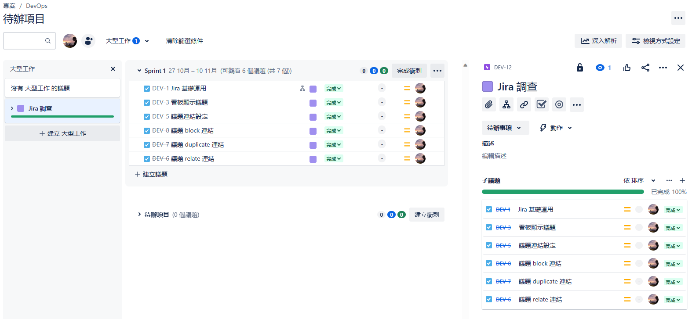

在篩選議題列表時，可以依據指派對象、大型工作 ( 所屬、無所屬 ) 來呈現；此外，若發現無所屬的議題可歸屬於大型工作，僅需點選後拖曳至大型工作的看板或在議題檢視的面板選擇新增大型工作來添加連結。

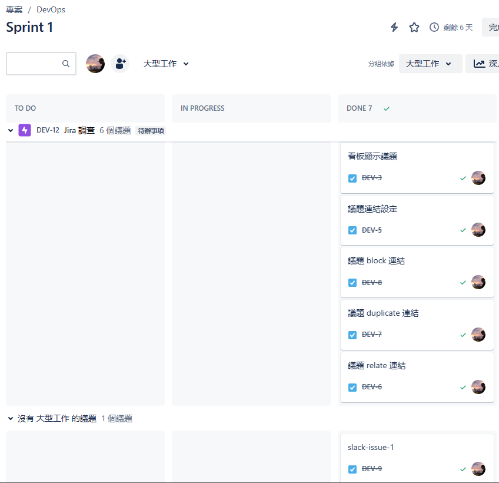

若將議題拖曳至衝刺 ( Sprint ) 中，則可以在看板介面呈現各議題的執行狀態，此時若有大型工作歸屬，可如上圖使用大型工作來做分組依據。

#### 子議題

子議題是議題中的細項，也可以解釋成實際需執行的內容，在 Jira 中議題可以設定子議題，但子議題則不可在設定子議題，亦即就規劃最底層就屬於子議題。

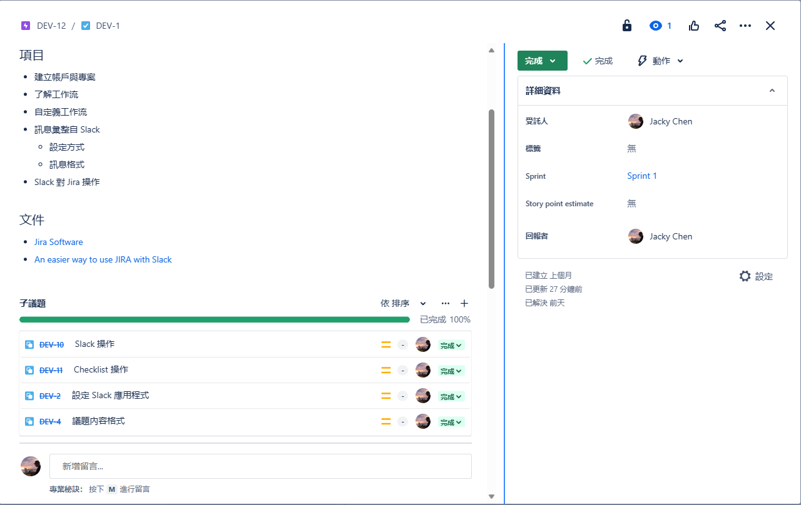

子議題的建立僅能在議題中設計，若要撰寫子議題細節則需從議題中點選，或利用看板的分組依據選擇子任務來呈現子議題。

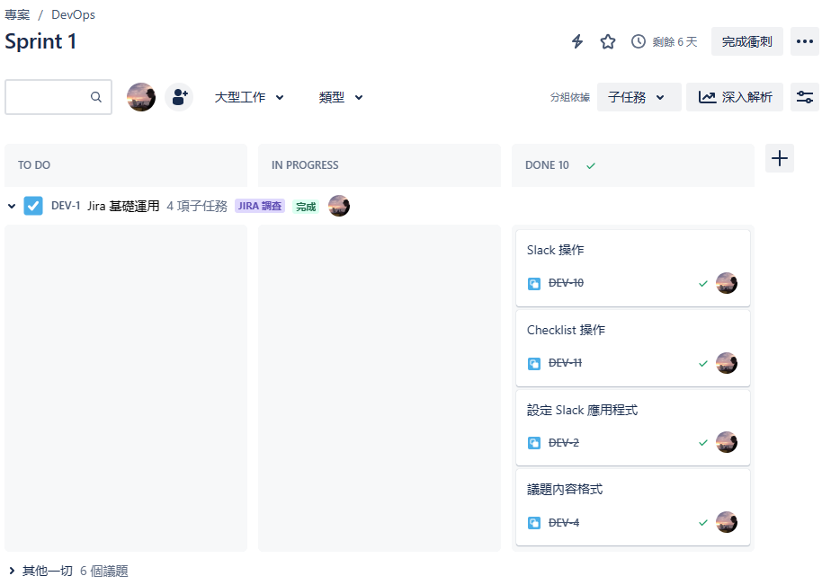

原則上，子議題之下無法再細分執行細節為議題，但倘若有在細分議題內容的處理項目，則需要安裝 Checklist 應用程式來增加可填寫的內容，或利用連結議題來設計議題間的關係做到類似檢核項目的列表。

#### 連結議題

無論是大型工作、議題、子議題都可設定連結，而連結的目的是建立議題間的上下關係、依賴關係，從而表達執行該議題前需先執行的內容，或描述相依內容，其後需執行的議題。

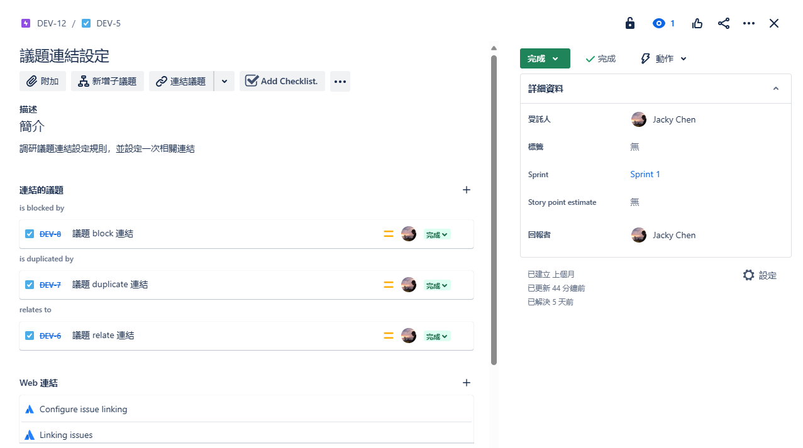

若使用圖形介面顯示，則如下圖所示。

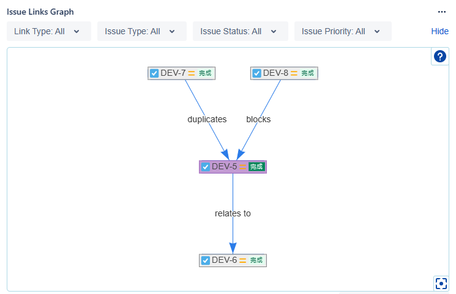
> 使用應用程式 [Issue Links Viewer](https://ist-devops.atlassian.net/jira/marketplace/discover/app/pl.com.tt.apdc.ilv)

雖然大型工作、議題、子議題本身具有階級關係，但議題間本身屬於獨立、平行的項目，透過連結的設計，可從而達到議題間的一體性。

在子議題說到，若子議題仍有細節需執行，可採用 Checklist 規劃，但若執行內容仍需符合 Scrum 的設計來計算每個 Sprint 的點數，則應該規劃為子議題並設立議題間的連結。

### 衝刺 ( Sprint )

在 Scrum 中，衝刺 ( Sprint ) 是一個持續開發週期，每個衝刺開始、結束都會討論並基於當前衝刺碰到的問題微調當前的方向與設計。

因此，開發團隊可以在設計議題時，會如下圖所示，預設都會在待辦清單中，等待建立衝刺後在依序拖進其中規劃出一個衝刺要處理的議題。

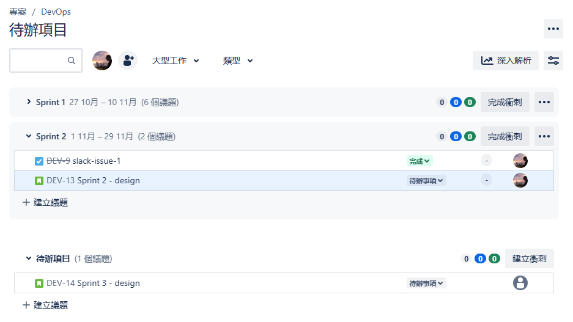

當衝刺規劃完成後，便可以開始衝刺，並預設實際開始時間，其後便可在看板中看到開啟的衝刺項目。

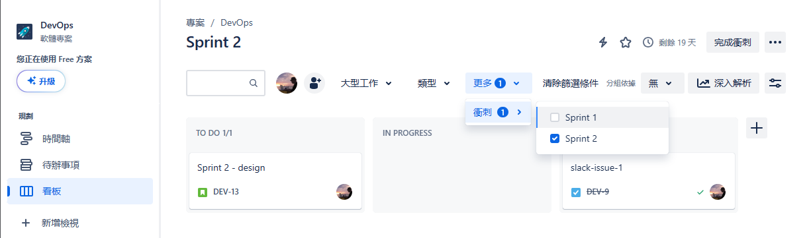

當衝刺結束，僅能在時間軸中回顧已經完成的項目，反之未完成的衝刺並不會出現在時間軸內，僅會出現該衝刺預計結束的時間。

## Jira 應用程式服務

Jira 預設的服務雖能處理 Scrum 中的議題規劃與管理，但若需要細節資訊的撰寫、圖形化資訊、外部服務整合，則需使用 Jira 提供的應用程式服務，以下為本次調研時查詢到有用的服務；需注意，多數的應用服務都有額外收費，亦可先搜尋 Free 版本或適用該應用。

+ [Issue Checklist for Jira. Free](https://ist-devops.atlassian.net/jira/marketplace/discover/app/com.herocoders.plugins.jira.issuechecklist-free)，在單一議題中只能設定個檢核清單
+ [Checklist for Jira On-the-Fly](https://ist-devops.atlassian.net/jira/marketplace/discover/app/com.alphaserve.checklist.jira-checklist)，在單一議題中能設定多個檢核清單
+ [Checklist for Jira Cloud. Free](https://ist-devops.atlassian.net/jira/marketplace/discover/app/com.appbox.ai.checklist)，在單一議題中能設定多個檢核清單並以分頁方式呈現
+ [Issue Links Viewer](https://ist-devops.atlassian.net/jira/marketplace/discover/app/pl.com.tt.apdc.ilv)，圖形化設定當前議題對其他議題的連結

## Jira 與 Slack

[Atlassian Marketplace - Slack Integration+ for Jira](https://marketplace.atlassian.com/apps/1219324/slack-integration-for-jira?hosting=cloud&tab=overview)

Jira 的 Slack 應用程式服務屬於官方提供的功能，其用途是提供 Slack 一個操作 Jira 的機器人，讓用戶可以在 Slack 觀看連結的 Jira 專案的狀態變化。

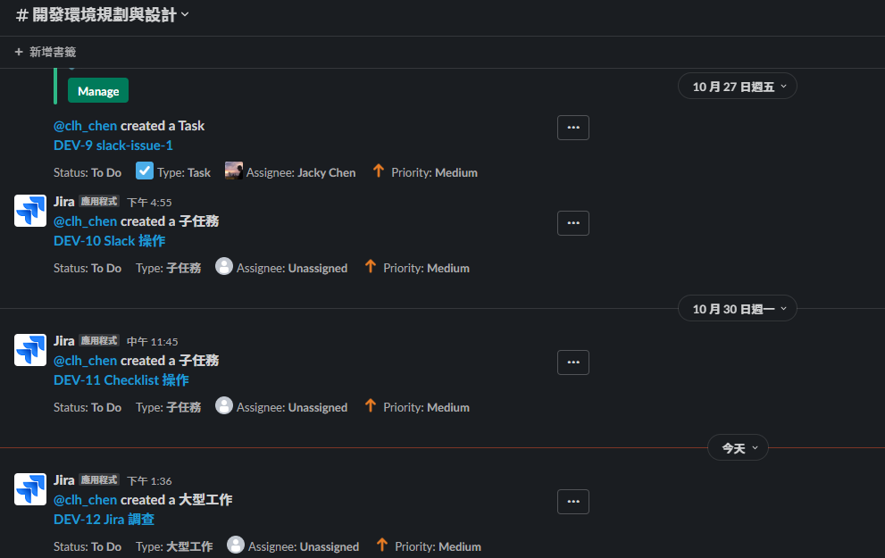

或透過 ```/jira``` 指令在頻道中詢問機器人，並取得 Jira 議題的資訊、連結，或改變指定議題的狀態。

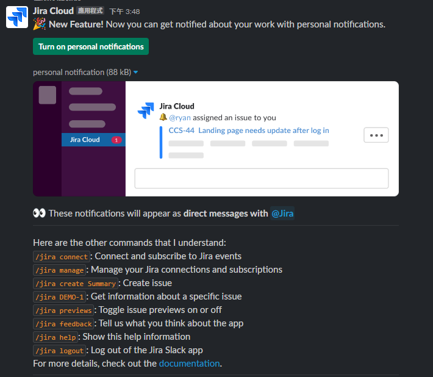

其中最主要的操作如下：

+ 頻道若要使用 Slack 需在頻道內執行 /jira connect
+ 若要建立議題使用 /jira create <issue-name>
+ 若要查看議題資訊 /jira <issue-id>
+ 若要對議題操作可以選擇如 transition 以推進議題

## Jira CLI

Jira CLI 是一套提供給 Python 語言執行的 Jira 操作工具，使用本專案的腳本可直接建立可運行的 Docker 環境。

```
jira-cli.bat
```

在進入容器後，可使用 ```jirashell``` 直接進入 iPython 對 Jira 進行操作。

```
jirashell -s https://<SITE-NAME>.atlassian.com \
  -u email \
  -p API token
```

或使用以下句型撰寫 Python 腳本中來登入 Jira Cloud。

```
# Some Authentication Methods
jira = JIRA(
    server="https://<SITE-NAME>.atlassian.com",
    basic_auth=("email", "API token")
)
```

在文獻指 Jira Cloud 所需的 API Token，是在[帳號安全性](https://id.atlassian.com/manage-profile/security)頁面的 API 權杖，並不是[管理員](https://admin.atlassian.com/)的設定 API 金鑰。

## Jira 與 Gitlab

+ [Atlassian Marketplace - GitLab for Jira Cloud](https://marketplace.atlassian.com/apps/1221011/gitlab-for-jira-cloud?hosting=cloud&tab=overview)
    - [Jira issue integration - Gitlab](https://docs.gitlab.com/ee/integration/jira/configure.html)
    - [Integrate with development tools - Jira](https://support.atlassian.com/jira-cloud-administration/docs/integrate-with-development-tools/)
    - [Process issues with smart commits](https://support.atlassian.com/jira-software-cloud/docs/process-issues-with-smart-commits/)
    - [View development information for an issue](https://support.atlassian.com/jira-software-cloud/docs/view-development-information-for-an-issue/)

Jira 與 Gitlab 整合，主要是透過提交程式碼過程，將修改記錄與資訊動態與 Jira 連結，其底層運作原理與前面的 Jira-CLI 相同。

如同前述取得一個 API 權杖後，進入 Gitlab，並步驟驗證

+ 前往 admin area
+ 左側選單中選擇 Settings -> Integrate
+ 右側選單中選擇 Jira
    - 在 Web URL 填寫 ```https://<SITE-NAME>.atlassian.com```
    - 在 Username or Email 填寫 ```email```
    - 在 Password or API token 填寫 ```token```
    - 儲存設定
+ 建立一個專案，並提交一個內容
    - commit 描述如下 ```<ISSUE_KEY> #comment <comment_string>```
+ 前往對應 ```<ISSUE_KEY>``` 的議題
    - commit 的內容會以超連結存在於議題中

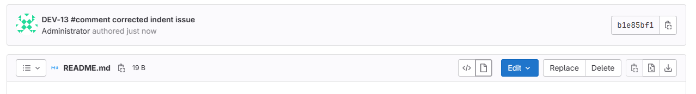  
  

在文章中，可以設定 Jira 的權限，啟用 View development tools 來呈現開發面板，以達到下圖的資訊呈現。

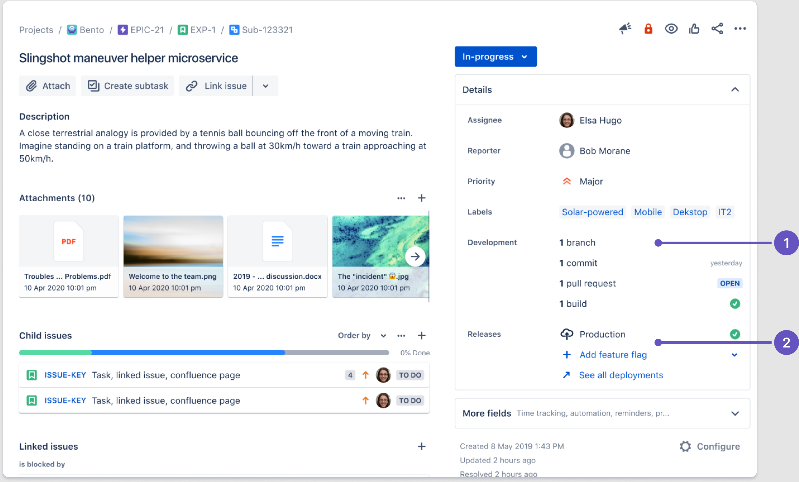
> from [View development information for an issue](https://support.atlassian.com/jira-software-cloud/docs/view-development-information-for-an-issue/)

由於本次調查使用免費版本無法修改權限，在此尚無法驗證是否設定可正常運作。

## 文獻

+ [Atlassian Jira](https://www.atlassian.com/software/jira)
    - [Jira - wiki](https://zh.wikipedia.org/wiki/JIRA)
    - [Jira cloud platform API](https://developer.atlassian.com/cloud/jira/platform/rest/v3/intro/#about)
+ [Atlassian Trello](https://trello.com/)
    - [Jira vs Trello](https://www.atlassian.com/zh/software/jira/comparison/jira-vs-trello)
+ [Slack](https://slack.com)
+ [Gitlab](https://about.gitlab.com/)
    - [Jira integrations](https://docs.gitlab.com/ee/integration/jira/index.html)
+ [jira-cli - Github](https://github.com/ankitpokhrel/jira-cli/tree/main)
    - [Jira - Python](https://jira.readthedocs.io/installation.html)
        + [Jira - pip](https://pypi.org/project/jira/)
+ 教學文獻
    - [【Jira 專案管理】Jira是什麽？如何用？詳細教學Scrum＋看板！](https://projectmanager.com.tw/%E5%B0%88%E6%A1%88%E7%AE%A1%E7%90%86%E5%B7%A5%E5%85%B7/jira-%E5%B0%88%E6%A1%88%E7%AE%A1%E7%90%86/)
    - [敏捷系列 | 一次搞懂敏捷專案管理中的Epic、Story/Task與Subtask](https://medium.com/alexchanglife/bc801f26e677)
