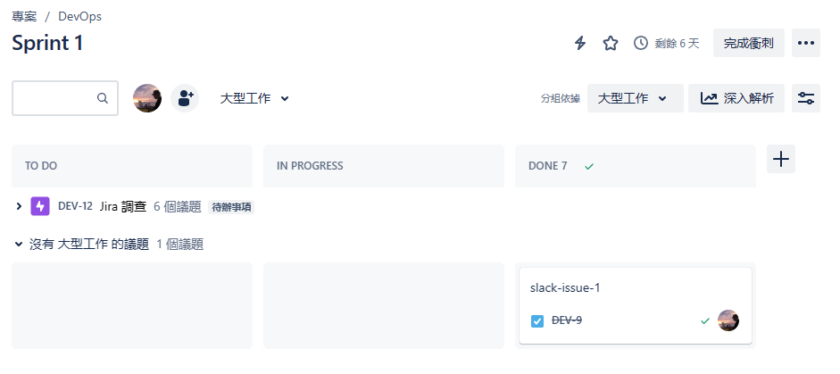

# infra-jira

JIRA 是一個缺陷跟蹤管理系統 ( Bug tracking system )，為針對缺陷管理、任務追蹤和專案管理的商業性應用軟體；其設計用來幫助品質保證和程式設計師在工作中維護軟體缺陷的跟蹤報告，也可以被認為是一種問題跟蹤管理系統 ( Issue tracking system )。

[Jira 軟體供應商宣布2024年停止支援伺服器版軟體](https://www.ithome.com.tw/news/140617)，目前官方文件推薦用戶申請可使用雲端的免費帳號進行適用。

## Atlassian

艾特萊森軟體 ( Atlassian Software ) 是一家澳大利亞軟體企業公司，主要為軟體開發者及項目經理設計軟體。這公司的主力產品為專門用作追蹤應用程式問題的 Jira，還有用作協作團隊的產品 Confluence，以及簡易項目管理的產品 Trello，版本管理儲存庫的產品 Bitbucket，版本管理工具 Sourcetree。

嚴格來說，多數的開發人員在其使用的專案管理工具不外乎都會與 Atlassian 有關聯；因此，若要使用相關服務，則需在 Atlassian 雲端註冊帳號，便可使用以下雲端服務，但需注意其收費機制是基於相關服務的總使用人數決定，超過定量人數會依居人數計算服務費用，若僅是個人使用多為免費機制，例如 Trello、Sourcetree。

+ 定價
    - [Jira](https://www.atlassian.com/zh/software/jira/pricing)
    - [Confluence](https://www.atlassian.com/zh/software/confluence/pricing)

若要使用相關服務，透過信箱自 [Atlassian 官方網站登入](https://id.atlassian.com/)，進入[用戶主頁](https://start.atlassian.com/)總覽所有服務的狀態，或進入[管理者介面](https://admin.atlassian.com/)檢視可用的產品與費用資訊。

##### 產品域名更換議題

在啟用 Jira 試用服務時，會需要設定一個產品名稱，其名稱也會構成域名網址，例如產品名稱為 ```product-name```，其域名為 ```product-name.atlassian.net```。

但若用戶僅是調查與試用後，確定正式與團隊合作使用，此時往往會需要替換為更符合團隊與公司需要的名稱，然而 Atlassian 並未提供更換域名的介面，若要更換域名則需發出支援單，請 Atlassian 官方協助更換。

+ [How do you change the name on an Atlas Workspace?](https://community.atlassian.com/t5/Atlas-questions/How-do-you-change-the-name-on-an-Atlas-Workspace/qaq-p/2252138)

另外，也有建議是申請一個新的帳號與空間並將資料與議題轉移至此空間，詳細操作參考 [Export data from Jira Cloud](https://support.atlassian.com/jira-cloud-administration/docs/export-issues/)。

## Jira Software


Jira 管理系統其資料結構如下：

+ [專案](#專案)
    - [議題](#議題)
        + [大型工作](#大型工作)
        + [子議題](#子議題)

### 專案

Jira 中可建立多個專案，以此區分對應不同軟體項目的設計議題管理。

在不同專案中，可調整如下項目：

+ ```專案 > 專案設定 > 存取```，以此調整可存取該專案的人員與角色，此項目需升級 Standard 才可使用。
+ ```專案 > 專案設定 > 議題類型```，以此調整此專案可用的議題類型與工作流。
+ ```專案 > 專案設定 > 看板```，以此調整看板呈現 Sprint 內容的欄位與方式。

其他項目可進入 ```專案 > 專案設定``` 觀察。

### 議題

Jira 對專案管理是根據敏捷開發 [Scrum](https://glints.com/tw/blog/learn-scrum-methodology-in-10-minutes/) 概念而設計，對於軟體需求的故事會拆解成無數個議題，從而在 Sprint 中逐次消化。

而每個議題可以擁有幾個關係：

+ 所屬的大型工作 ( Epic )
+ 可細分的子議題 ( Sub Issue )
+ 議題間的連結 ( Issue Linking )

#### 大型工作

大型工作 ( Epic ) 是指一個龐大的故事、任務組合的大型議題，若要對大型工作描述，則其要執行的內容屬於概念、待設計、尚有調整必要的議題，而其下的議題則是對此工作的解釋與調整。


在篩選議題列表時，可以依據指派對象、大型工作 ( 所屬、無所屬 ) 來呈現；此外，若發現無所屬的議題可歸屬於大型工作，僅需點選後拖曳至大型工作的看板或在議題檢視的面板選擇新增大型工作來添加連結。



若將議題拖曳至衝刺 ( Sprint ) 中，則可以在看板介面呈現各議題的執行狀態，此時若有大型工作歸屬，可如上圖使用大型工作來做分組依據。

#### 子議題

#### 議題連結

### 衝刺 ( Sprint )

## Jira 應用服務

+ [Issue Checklist for Jira. Free](https://ist-devops.atlassian.net/jira/marketplace/discover/app/com.herocoders.plugins.jira.issuechecklist-free)，在單一議題中只能設定個檢核清單
+ [Checklist for Jira On-the-Fly](https://ist-devops.atlassian.net/jira/marketplace/discover/app/com.alphaserve.checklist.jira-checklist)，在單一議題中能設定多個檢核清單
+ [Checklist for Jira Cloud. Free](https://ist-devops.atlassian.net/jira/marketplace/discover/app/com.appbox.ai.checklist)，在單一議題中能設定多個檢核清單並以分頁方式呈現

## Jira 與 Slack

[Atlassian Marketplace - Slack Integration+ for Jira](https://marketplace.atlassian.com/apps/1219324/slack-integration-for-jira?hosting=cloud&tab=overview)

## Jira 與 Gitlab

[Atlassian Marketplace - GitLab for Jira Cloud](https://marketplace.atlassian.com/apps/1221011/gitlab-for-jira-cloud?hosting=cloud&tab=overview)
    - [Jira issue integration - Gitlab](https://docs.gitlab.com/ee/integration/jira/configure.html)
    - [Integrate with development tools - Jira](https://support.atlassian.com/jira-cloud-administration/docs/integrate-with-development-tools/)
    - [Process issues with smart commits](https://support.atlassian.com/jira-software-cloud/docs/process-issues-with-smart-commits/)
    - [View development information for an issue](https://support.atlassian.com/jira-software-cloud/docs/view-development-information-for-an-issue/)

## 文獻

+ [Atlassian Jira](https://www.atlassian.com/software/jira)
    - [Jira - wiki](https://zh.wikipedia.org/wiki/JIRA)
    - [Jira cloud platform API](https://developer.atlassian.com/cloud/jira/platform/rest/v3/intro/#about)
+ [Atlassian Trello](https://trello.com/)
    - [Jira vs Trello](https://www.atlassian.com/zh/software/jira/comparison/jira-vs-trello)
+ [Slack](https://slack.com)
+ [Gitlab](https://about.gitlab.com/)
    - [Jira integrations](https://docs.gitlab.com/ee/integration/jira/index.html)
+ [jira-cli - Github](https://github.com/ankitpokhrel/jira-cli/tree/main)
    - [Jira - Python](https://jira.readthedocs.io/installation.html)
        + [Jira - pip](https://pypi.org/project/jira/)
+ 教學文獻
    - [【Jira 專案管理】Jira是什麽？如何用？詳細教學Scrum＋看板！](https://projectmanager.com.tw/%E5%B0%88%E6%A1%88%E7%AE%A1%E7%90%86%E5%B7%A5%E5%85%B7/jira-%E5%B0%88%E6%A1%88%E7%AE%A1%E7%90%86/)
    - [敏捷系列 | 一次搞懂敏捷專案管理中的Epic、Story/Task與Subtask](https://medium.com/alexchanglife/bc801f26e677)
